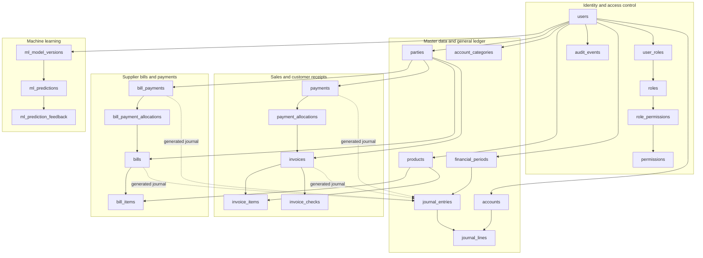
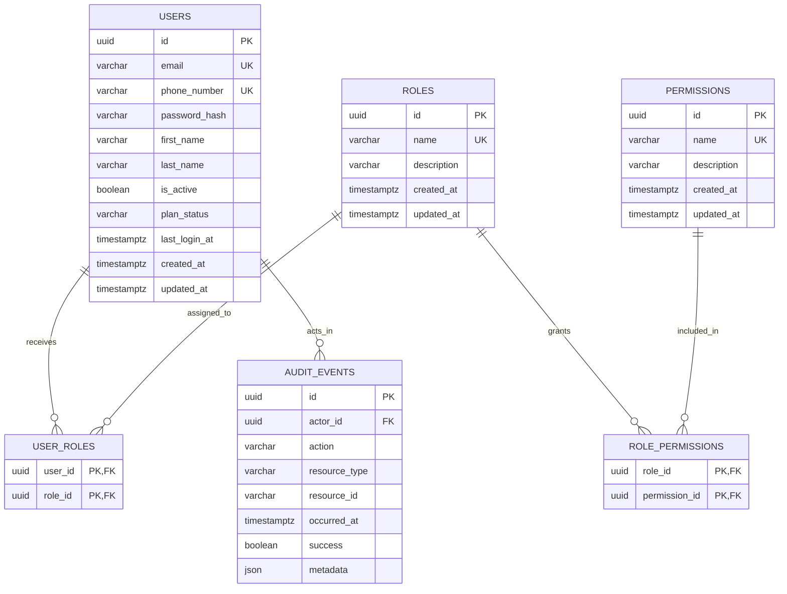
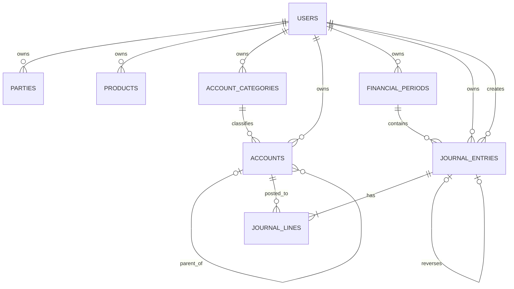
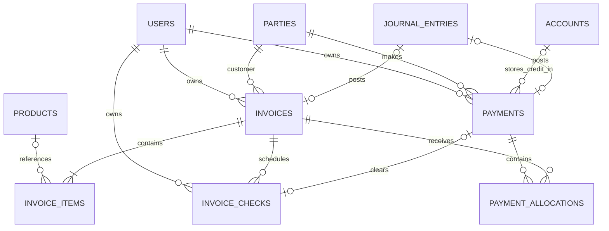
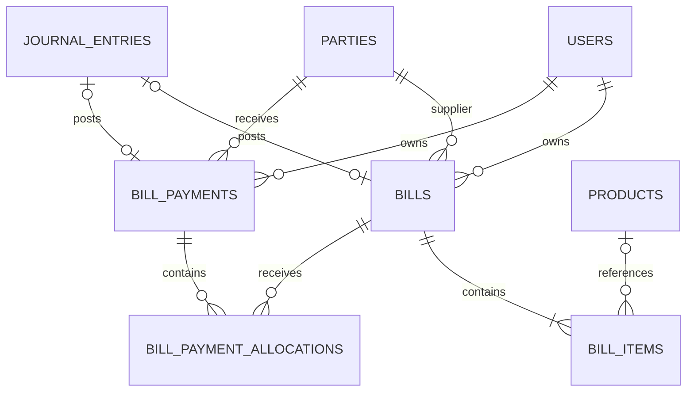
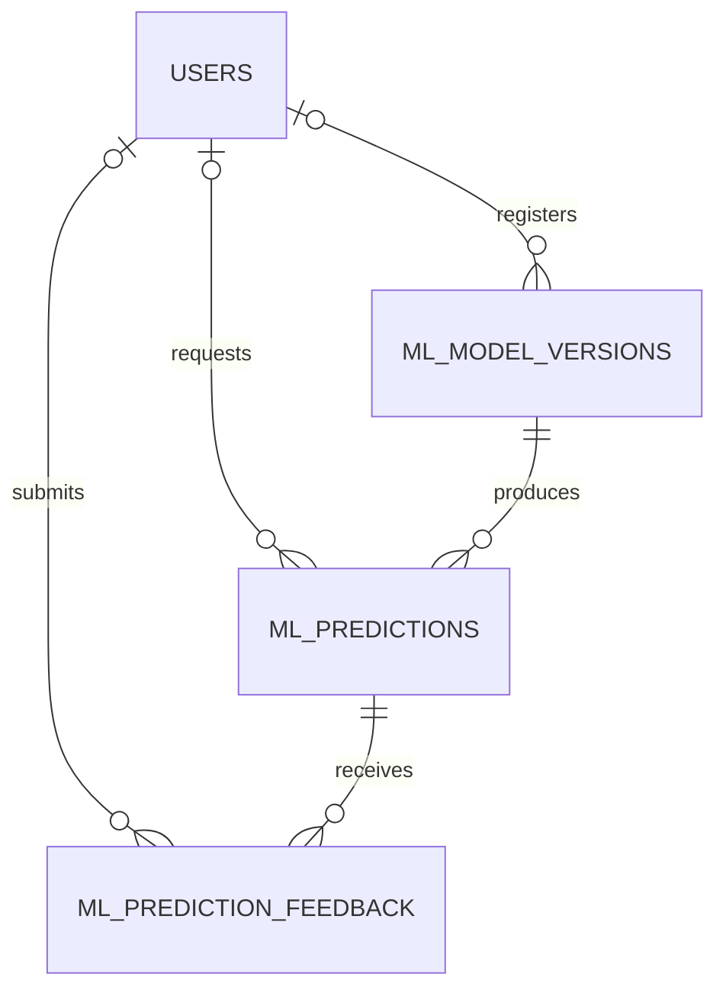

# Azari Intelligent Accounting — Database Schema

This document describes the current logical PostgreSQL schema implemented by the SQLAlchemy models and Alembic migrations.

## Schema summary

- Database engine: PostgreSQL 16
- Current Alembic head: `20260903_0011`
- Application tables: 25
- Alembic bookkeeping table: `alembic_version`
- Primary keys: UUID
- Monetary values: `NUMERIC(18,2)`
- Quantities: `NUMERIC(18,4)`
- Business ownership: `owner_id → users.id`
- ML metadata: PostgreSQL `JSONB`

Most accounting records are private to one user workspace through `owner_id`. Identity, RBAC, audit, and the application-wide ML model registry are shared infrastructure.

## Legend

| Symbol | Meaning |
|---|---|
| PK | Primary key |
| FK | Foreign key |
| UQ | Unique constraint or unique index |
| NN | Not null |
| NULL | Optional column |

Common model fields:

- `id UUID PK`
- Timestamped records normally contain `created_at TIMESTAMPTZ` and `updated_at TIMESTAMPTZ`.
- Workspace-owned records contain `owner_id UUID FK → users.id`.

## High-level relationship map



## Identity and RBAC schema



### `users`

| Column | Type | Rules |
|---|---|---|
| `id` | UUID | PK |
| `email` | VARCHAR(320) | NULL, UQ |
| `phone_number` | VARCHAR(32) | NULL, partial UQ when non-null |
| `password_hash` | VARCHAR(512) | NN |
| `first_name` | VARCHAR(100) | NN |
| `last_name` | VARCHAR(100) | NN |
| `is_active` | BOOLEAN | NN, default `true` |
| `plan_status` | VARCHAR(20) | NN, default `FREE` |
| `last_login_at` | TIMESTAMPTZ | NULL |
| `created_at` | TIMESTAMPTZ | NN |
| `updated_at` | TIMESTAMPTZ | NN |

Constraints:

- At least one of `email` and `phone_number` must be non-null.
- `plan_status IN ('FREE','PRO')`.
- Multiple users may have a null phone number, but non-null phone numbers are unique.

### `roles`

| Column | Type | Rules |
|---|---|---|
| `id` | UUID | PK |
| `name` | VARCHAR(50) | NN, UQ |
| `description` | VARCHAR(255) | NN |
| `created_at` | TIMESTAMPTZ | NN |
| `updated_at` | TIMESTAMPTZ | NN |

Canonical seeded roles are `ADMIN`, `OWNER`, `ACCOUNTANT`, `MANAGER`, and `VIEWER`.

### `permissions`

| Column | Type | Rules |
|---|---|---|
| `id` | UUID | PK |
| `name` | VARCHAR(100) | NN, UQ |
| `description` | VARCHAR(255) | NN |
| `created_at` | TIMESTAMPTZ | NN |
| `updated_at` | TIMESTAMPTZ | NN |

### `user_roles`

Composite primary key: `(user_id, role_id)`.

| Column | Type | Relationship |
|---|---|---|
| `user_id` | UUID | PK, FK → `users.id`, cascade on delete |
| `role_id` | UUID | PK, FK → `roles.id`, cascade on delete |

### `role_permissions`

Composite primary key: `(role_id, permission_id)`.

| Column | Type | Relationship |
|---|---|---|
| `role_id` | UUID | PK, FK → `roles.id`, cascade on delete |
| `permission_id` | UUID | PK, FK → `permissions.id`, cascade on delete |

### `audit_events`

| Column | Type | Rules |
|---|---|---|
| `id` | UUID | PK |
| `actor_id` | UUID | NULL, FK → `users.id`, set null on user deletion |
| `action` | VARCHAR(100) | NN, indexed |
| `resource_type` | VARCHAR(100) | NN |
| `resource_id` | VARCHAR(100) | NULL |
| `occurred_at` | TIMESTAMPTZ | NN, indexed |
| `success` | BOOLEAN | NN |
| `metadata` | JSON | NN |

## Master data and general-ledger schema



### `parties`

| Column | Type | Rules |
|---|---|---|
| `id` | UUID | PK |
| `owner_id` | UUID | NN, FK → `users.id` |
| `name` | VARCHAR(200) | NN, indexed |
| `email` | VARCHAR(320) | NULL |
| `phone` | VARCHAR(50) | NULL |
| `address` | TEXT | NULL |
| `is_customer` | BOOLEAN | NN, default `false` |
| `is_supplier` | BOOLEAN | NN, default `false` |
| `is_active` | BOOLEAN | NN, default `true` |
| `created_at`, `updated_at` | TIMESTAMPTZ | NN |

Constraint: a party must be a customer, a supplier, or both.

### `products`

| Column | Type | Rules |
|---|---|---|
| `id` | UUID | PK |
| `owner_id` | UUID | NN, FK → `users.id` |
| `sku` | VARCHAR(80) | NN, unique per owner |
| `name` | VARCHAR(200) | NN |
| `description` | TEXT | NULL |
| `unit` | VARCHAR(30) | NN, default `each` |
| `unit_price` | NUMERIC(18,2) | NN, non-negative |
| `is_active` | BOOLEAN | NN, default `true` |
| `created_at`, `updated_at` | TIMESTAMPTZ | NN |

### `account_categories`

| Column | Type | Rules |
|---|---|---|
| `id` | UUID | PK |
| `owner_id` | UUID | NN, FK → `users.id` |
| `name` | VARCHAR(100) | NN, unique per owner |
| `account_type` | VARCHAR(20) | NN |
| `created_at`, `updated_at` | TIMESTAMPTZ | NN |

Allowed account types: `ASSET`, `LIABILITY`, `EQUITY`, `REVENUE`, `EXPENSE`.

### `accounts`

| Column | Type | Rules |
|---|---|---|
| `id` | UUID | PK |
| `owner_id` | UUID | NN, FK → `users.id` |
| `code` | VARCHAR(40) | NN, unique per owner |
| `name` | VARCHAR(200) | NN |
| `category_id` | UUID | NN, FK → `account_categories.id` |
| `parent_id` | UUID | NULL, self-FK → `accounts.id` |
| `posting_role` | VARCHAR(20) | NN, default `GENERAL` |
| `is_active` | BOOLEAN | NN, default `true` |
| `created_at`, `updated_at` | TIMESTAMPTZ | NN |

Allowed posting roles:

```text
GENERAL, CASH, RECEIVABLE, REVENUE,
TAX_LIABILITY, PAYABLE, EXPENSE, CUSTOMER_CREDIT
```

The database prevents an account from being its own parent. The service also rejects circular hierarchies and prevents category or posting-role changes after the account has posted journal history.

### `financial_periods`

| Column | Type | Rules |
|---|---|---|
| `id` | UUID | PK |
| `owner_id` | UUID | NN, FK → `users.id` |
| `name` | VARCHAR(100) | NN, unique per owner |
| `start_date` | DATE | NN, indexed |
| `end_date` | DATE | NN, indexed |
| `status` | VARCHAR(10) | NN, default `OPEN` |
| `created_at`, `updated_at` | TIMESTAMPTZ | NN |

Constraints:

- `start_date <= end_date`
- `status IN ('OPEN','CLOSED')`

### `journal_entries`

| Column | Type | Rules |
|---|---|---|
| `id` | UUID | PK |
| `owner_id` | UUID | NN, FK → `users.id` |
| `entry_number` | VARCHAR(80) | NN, unique per owner |
| `entry_date` | DATE | NN, indexed |
| `description` | VARCHAR(500) | NN |
| `period_id` | UUID | NN, FK → `financial_periods.id` |
| `status` | VARCHAR(12) | NN, default `DRAFT` |
| `created_by_id` | UUID | NULL, FK → `users.id`, set null on deletion |
| `reversal_of_id` | UUID | NULL, UQ, self-FK → `journal_entries.id` |
| `created_at`, `updated_at` | TIMESTAMPTZ | NN |

Allowed statuses: `DRAFT`, `POSTED`, `CANCELLED`.

### `journal_lines`

| Column | Type | Rules |
|---|---|---|
| `id` | UUID | PK |
| `journal_id` | UUID | NN, FK → `journal_entries.id`, cascade on delete |
| `account_id` | UUID | NN, FK → `accounts.id`, restrict deletion |
| `description` | VARCHAR(500) | NULL |
| `debit` | NUMERIC(18,2) | NN, default `0` |
| `credit` | NUMERIC(18,2) | NN, default `0` |

Each line must contain a positive amount on exactly one side. Whole-journal equality is enforced transactionally by the accounting service before posting:

```text
SUM(journal_lines.debit) = SUM(journal_lines.credit)
```

## Sales, checks, and customer-receipt schema



### `invoices`

| Column | Type | Rules |
|---|---|---|
| `id` | UUID | PK |
| `owner_id` | UUID | NN, FK → `users.id` |
| `invoice_number` | VARCHAR(80) | NN, unique per owner |
| `customer_id` | UUID | NN, FK → `parties.id`, restrict deletion |
| `issue_date` | DATE | NN |
| `due_date` | DATE | NN |
| `status` | VARCHAR(20) | NN, default `DRAFT` |
| `payment_method` | VARCHAR(10) | NULL |
| `subtotal` | NUMERIC(18,2) | NN, non-negative |
| `tax` | NUMERIC(18,2) | NN, non-negative |
| `total` | NUMERIC(18,2) | NN, non-negative |
| `amount_paid` | NUMERIC(18,2) | NN, non-negative |
| `journal_id` | UUID | NULL, UQ, FK → `journal_entries.id` |
| `created_at`, `updated_at` | TIMESTAMPTZ | NN |

Constraints:

- `issue_date <= due_date`
- Status: `DRAFT`, `ISSUED`, `PARTIALLY_PAID`, `PAID`, or `CANCELLED`
- Payment method: null, `CASH`, or `CHECK`

### `invoice_items`

| Column | Type | Rules |
|---|---|---|
| `id` | UUID | PK |
| `invoice_id` | UUID | NN, FK → `invoices.id`, cascade on delete |
| `product_id` | UUID | NULL, FK → `products.id`, restrict deletion |
| `description` | VARCHAR(500) | NN |
| `quantity` | NUMERIC(18,4) | NN, positive |
| `unit_price` | NUMERIC(18,2) | NN, non-negative |
| `tax` | NUMERIC(18,2) | NN, non-negative |
| `line_subtotal` | NUMERIC(18,2) | NN, non-negative |
| `line_total` | NUMERIC(18,2) | NN, non-negative |

### `invoice_checks`

| Column | Type | Rules |
|---|---|---|
| `id` | UUID | PK |
| `owner_id` | UUID | NN, FK → `users.id` |
| `invoice_id` | UUID | NN, FK → `invoices.id`, cascade on delete |
| `amount` | NUMERIC(18,2) | NN, positive |
| `sayad_id` | VARCHAR(32) | NULL, unique per owner when supplied |
| `due_date` | DATE | NN |
| `status` | VARCHAR(12) | NN, default `PENDING` |
| `cleared_date` | DATE | NULL |
| `cleared_payment_id` | UUID | NULL, UQ, FK → `payments.id` |
| `created_at`, `updated_at` | TIMESTAMPTZ | NN |

Allowed statuses: `PENDING`, `CLEARED`, `BOUNCED`.

### `payments`

| Column | Type | Rules |
|---|---|---|
| `id` | UUID | PK |
| `owner_id` | UUID | NN, FK → `users.id` |
| `party_id` | UUID | NN, FK → `parties.id`, restrict deletion |
| `payment_date` | DATE | NN |
| `amount` | NUMERIC(18,2) | NN, positive |
| `reference` | VARCHAR(100) | NN, unique per owner |
| `method` | VARCHAR(50) | NN |
| `sayad_id` | VARCHAR(100) | NULL |
| `customer_credit_account_id` | UUID | NULL, FK → `accounts.id`, restrict deletion |
| `status` | VARCHAR(12) | NN, default `DRAFT` |
| `journal_id` | UUID | NULL, UQ, FK → `journal_entries.id` |
| `created_at`, `updated_at` | TIMESTAMPTZ | NN |

Allowed statuses: `DRAFT`, `POSTED`, `CANCELLED`.

### `payment_allocations`

| Column | Type | Rules |
|---|---|---|
| `id` | UUID | PK |
| `payment_id` | UUID | NN, FK → `payments.id`, cascade on delete |
| `invoice_id` | UUID | NN, FK → `invoices.id`, restrict deletion |
| `amount` | NUMERIC(18,2) | NN, positive |

Unique constraint: one `(payment_id, invoice_id)` pair per payment.

## Supplier bills and outgoing-payment schema



### `bills`

| Column | Type | Rules |
|---|---|---|
| `id` | UUID | PK |
| `owner_id` | UUID | NN, FK → `users.id` |
| `bill_number` | VARCHAR(80) | NN, unique per owner |
| `supplier_id` | UUID | NN, FK → `parties.id`, restrict deletion |
| `issue_date` | DATE | NN |
| `due_date` | DATE | NN |
| `status` | VARCHAR(20) | NN, default `DRAFT` |
| `subtotal` | NUMERIC(18,2) | NN, non-negative |
| `tax` | NUMERIC(18,2) | NN, non-negative |
| `total` | NUMERIC(18,2) | NN, non-negative |
| `amount_paid` | NUMERIC(18,2) | NN, non-negative |
| `journal_id` | UUID | NULL, UQ, FK → `journal_entries.id` |
| `created_at`, `updated_at` | TIMESTAMPTZ | NN |

Constraints:

- `issue_date <= due_date`
- Status: `DRAFT`, `ISSUED`, `PARTIALLY_PAID`, `PAID`, or `CANCELLED`

### `bill_items`

| Column | Type | Rules |
|---|---|---|
| `id` | UUID | PK |
| `bill_id` | UUID | NN, FK → `bills.id`, cascade on delete |
| `product_id` | UUID | NULL, FK → `products.id`, restrict deletion |
| `description` | VARCHAR(500) | NN |
| `quantity` | NUMERIC(18,4) | NN, positive |
| `unit_price` | NUMERIC(18,2) | NN, non-negative |
| `tax` | NUMERIC(18,2) | NN, non-negative |
| `line_subtotal` | NUMERIC(18,2) | NN, non-negative |
| `line_total` | NUMERIC(18,2) | NN, non-negative |

### `bill_payments`

| Column | Type | Rules |
|---|---|---|
| `id` | UUID | PK |
| `owner_id` | UUID | NN, FK → `users.id` |
| `party_id` | UUID | NN, FK → `parties.id`, restrict deletion |
| `payment_date` | DATE | NN |
| `amount` | NUMERIC(18,2) | NN, positive |
| `reference` | VARCHAR(100) | NN, unique per owner |
| `method` | VARCHAR(50) | NN |
| `sayad_id` | VARCHAR(100) | NULL |
| `status` | VARCHAR(12) | NN, default `DRAFT` |
| `journal_id` | UUID | NULL, UQ, FK → `journal_entries.id` |
| `created_at`, `updated_at` | TIMESTAMPTZ | NN |

Allowed statuses: `DRAFT`, `POSTED`, `CANCELLED`.

### `bill_payment_allocations`

| Column | Type | Rules |
|---|---|---|
| `id` | UUID | PK |
| `bill_payment_id` | UUID | NN, FK → `bill_payments.id`, cascade on delete |
| `bill_id` | UUID | NN, FK → `bills.id`, restrict deletion |
| `amount` | NUMERIC(18,2) | NN, positive |

Unique constraint: one `(bill_payment_id, bill_id)` pair per payment.

## Machine-learning schema



### `ml_model_versions`

| Column | Type | Rules |
|---|---|---|
| `id` | UUID | PK |
| `pipeline` | VARCHAR(50) | NN |
| `model_version` | VARCHAR(100) | NN |
| `artifact_identifier` | VARCHAR(255) | NN |
| `artifact_digest` | VARCHAR(64) | NULL |
| `artifact_schema_version` | VARCHAR(30) | NN |
| `dataset_fingerprint` | VARCHAR(64) | NN |
| `feature_schema` | JSONB | NN |
| `training_configuration` | JSONB | NN |
| `metrics` | JSONB | NN |
| `dependencies` | JSONB | NN |
| `synthetic_data` | BOOLEAN | NN |
| `is_active` | BOOLEAN | NN, default `false` |
| `activated_at` | TIMESTAMPTZ | NULL |
| `created_by_id` | UUID | NULL, FK → `users.id`, set null on deletion |
| `created_at`, `updated_at` | TIMESTAMPTZ | NN |

Allowed pipelines:

```text
transaction_classification
payment_delay_risk
cash_flow_forecast
customer_segmentation
```

Constraints and indexes:

- Unique `(pipeline, model_version)`.
- Partial unique index on `pipeline WHERE is_active`, allowing only one active version per pipeline.
- This table is application-wide and does not contain `owner_id`.

### `ml_predictions`

| Column | Type | Rules |
|---|---|---|
| `id` | UUID | PK |
| `model_version_id` | UUID | NN, FK → `ml_model_versions.id`, restrict deletion |
| `pipeline` | VARCHAR(50) | NN |
| `source_type` | VARCHAR(50) | NULL |
| `source_id` | VARCHAR(100) | NULL |
| `predicted_value` | JSONB | NN |
| `confidence` | DOUBLE PRECISION | NULL, range 0–1 |
| `review_required` | BOOLEAN | NULL |
| `explanation` | JSONB | NULL |
| `requested_by_id` | UUID | NULL, FK → `users.id`, set null on deletion |
| `predicted_at` | TIMESTAMPTZ | NN |

### `ml_prediction_feedback`

| Column | Type | Rules |
|---|---|---|
| `id` | UUID | PK |
| `prediction_id` | UUID | NN, FK → `ml_predictions.id`, restrict deletion |
| `actual_value` | VARCHAR(500) | NULL |
| `feedback_type` | VARCHAR(20) | NN |
| `comment` | TEXT | NULL |
| `submitted_by_id` | UUID | NULL, FK → `users.id`, set null on deletion |
| `submitted_at` | TIMESTAMPTZ | NN |

Allowed feedback types: `VERIFIED`, `CORRECTION`, and `COMMENT`.

## Accounting relationships with generated journals

The following business records may each reference one generated journal through a unique `journal_id`:

| Business operation | Generated posting |
|---|---|
| Invoice issue | Debit receivable; credit revenue and optional tax liability |
| Customer payment | Debit cash; credit receivable and optional customer credit |
| Supplier bill issue | Debit expense for full bill total; credit payable |
| Supplier bill payment | Debit payable; credit cash |

Because `journal_id` is unique on each source table, one source record cannot point to several generated journals. Service-level status checks also prevent repeated posting.

## Ownership boundaries

The following tables are directly workspace-owned:

```text
parties
products
account_categories
accounts
financial_periods
journal_entries
invoices
invoice_checks
payments
bills
bill_payments
```

Their child rows inherit ownership through their parent relationships:

```text
journal_lines              → journal_entries
invoice_items              → invoices
payment_allocations        → payments and invoices
bill_items                 → bills
bill_payment_allocations   → bill_payments and bills
```

Repositories filter accounting reads by the authenticated user's `owner_id`. Foreign-key ownership consistency is additionally validated by the accounting service when records are created or posted.

## Important invariants

Some invariants are database constraints, while cross-row accounting rules are enforced by the service transaction:

| Invariant | Enforcement |
|---|---|
| Money and quantity are non-negative | Database CHECK constraints and schemas |
| Each journal line has one positive side | Database CHECK constraint |
| Total debit equals total credit | Accounting service before POSTED status |
| Posting occurs only in an open period | Accounting service with row locking |
| Invoice and bill totals are recalculated | Accounting service |
| Zero-total invoices and bills are rejected | Accounting service |
| Payment cannot over-allocate an invoice | Service validation plus PostgreSQL row lock |
| Bill payment cannot over-allocate a bill | Service validation plus PostgreSQL row lock |
| Posted account classification is immutable | Service validation plus account row lock |
| One active ML model per pipeline | Partial unique database index |
| User workspaces are isolated | `owner_id` plus repository/service filtering |

## Migration history

The current migration chain includes:

1. Initial accounting vertical slice
2. Identity and RBAC
3. Reporting indexes
4. ML integration
5. Stage 9 accounting hardening
6. Supplier bills and payables
7. User phone number and plan status
8. Email-or-phone authentication
9. Invoice payment checks
10. Customer credit and optional Sayad identifier
11. Private user workspaces
12. OWNER registration role migration

The exact revision identifiers are stored under `backend/alembic/versions/`. Alembic's `alembic_version` table records which revision is applied to a database.

## Source of truth

This schema was generated from the current models in:

- `backend/app/db/models/identity.py`
- `backend/app/db/models/accounting.py`
- `backend/app/db/models/audit.py`
- `backend/app/db/models/ml.py`
- Alembic migrations through `20260903_0011`

No database records, credentials, passwords, tokens, or `.env` values are included in this document.
